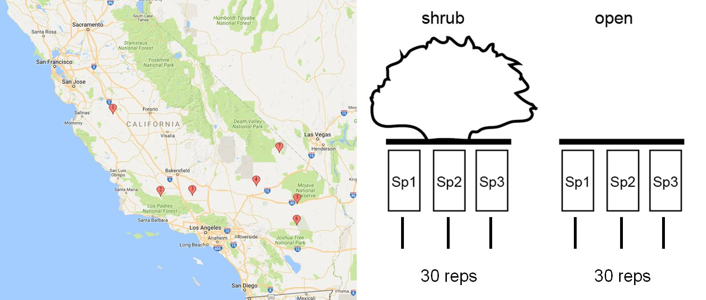

###Ephedra regional gradient (ERG) analyses


[ecoblender](http://ecoblender.org)

[alex.filazzola](http://www.filazzola.info)

#### Abstract

An under-examined component of the shrub-annual relationship is how regional drivers, such as climate, may alter the sign or magnitude of positive interactions. Interspecific interactions between plants have been shown to be strongly linked to climate, particularly temperature and precipitation. The stress-gradient hypothesis (SGH) predicts that higher abiotic stress (i.e. for deserts, increasing temperature and reduced precipitation) will increase the frequency of positive interactions among shrubs and their annual understory. Regional climate gradients also have indirect effects on plant composition, such as determining consumer abundance and soil nutrient composition. Nutrient availability is particularly affected by precipitation because of altered decomposition rates of organic matter and mineralization. Therefore, the strength of facilitation and operating mechanism of a shrub on the annual plant community may change along a regional gradient. 

#### Hypothesis

We tested the hypothesis that positive interactions among shrubs and annual plants will increase with abiotic stress and reduce nutrient availability along a regional gradient of aridity.

#### Methods



```{r load packages, echo=FALSE, warning=FALSE, message=FALSE}
## load packages for spatial manipulation
library(raster)
library(rgdal)
library(dismo)
#library(rJava)
#library(maptools)
library(dplyr)
library(vegan)
library(MASS)
library(ggplot2)
library(tidyverse)
library(ggthemes)
library(usdm)
library(broom)
```


``` {r load functions, echo=FALSE}
error.bar <- function(x, y, upper, lower=upper, length=0,...){
if(length(x) != length(y) | length(y) !=length(lower) | length(lower) != length(upper))
stop("vectors must be same length")
arrows(x,y+upper, x, y-lower, angle=90, code=3, length=length, ...)
}

se <- function(x, ...) sd(x)/sqrt(length(x)) ## standard error

source("functions.r")

## inverse hyperbolic sine transformation for zero laden data that fits log transformations
##Zhang, M., Fortney, J. C., Tilford, J. M., & Rost, K. M. (2000). An application of the inverse hyperbolic sine transformation—a note. Health Services and Outcomes Research Methodology, 1(2), 165-171.
ihs <- function(x) {
    y <- log(x + sqrt(x ^ 2 + 1))
    return(y)
}


rii <- function(x, j, var)
{
s1 <- subset(x, Microsite == "shrub", select=var)
o1 <- subset(x, Microsite == "open", select=var)
return1 <- (s1 - o1) / (s1+o1)
x1 <- x[seq(1, nrow(x), by = 2),]
return2 <- cbind(x1[j], return1)
return2[is.na(return2)] <- 0
return(return2)
}
```

### Weather for growing season
```{r echo=FALSE, fid.width=28, warning=FALSE, message=FALSE}

## weather station data

data <- read.table("Data/ERG.climatedata.csv", header=T,sep=",")
site.names <- c("Panoche","Cuyama","Tejon","Barstow","hwy40","Sheephole","Tecopa")
season1 <- subset(data, year==2015 & month > 10 | year==2016 & month < 5)
season2 <- subset(data, year==2016 & month > 10 | year==2017 & month < 5)
data <- rbind(season1,season2)
data[,"season"] <- c(rep("season.1",nrow(season1)),rep("season.2",nrow(season2)))
data <- na.omit(data)

means <- aggregate(data$avg.temp, by=list(data$season,data$Gradient), mean)
means.se <- aggregate(data$avg.temp, by=list(data$season,data$Gradient), se)
means[,"se"] <- means.se[,3]
colnames(means) <- c("season","gradient","avg","se")
means[,"upper"] <- means[,"avg"]+means[,"se"]*1.96
means[,"lower"] <- means[,"avg"]-means[,"se"]*1.96

q <- ggplot(means, aes(x=gradient, y=avg, ymin=lower, ymax=upper, fill=season)) +  geom_pointrange( position=position_dodge(width=0.4), color = rep(c("Grey50","Black"),7), size=1)+ guides(fill = "none") + scale_fill_manual(values = c("Black","Grey50"))+ scale_x_discrete(limits=c("Panoche","Cuyama","Tejon","Barstow","hwy40","Sheephole","Tecopa")) + scale_y_continuous(expand = c(0, 0)) + ylab("Average Temperature (C°)") + theme_Publication()
q

#precipitation
precip <- aggregate(data$Precip, by=list(data$season,data$Gradient), sum)
colnames(precip) <- c("season","Gradient","Precip")

p <-ggplot(precip, aes(Gradient, Precip, fill=season)) +geom_bar(stat = "identity", aes(fill = season), position = "dodge")+ scale_fill_manual(values = c("Black","Grey50"))+ scale_x_discrete(limits=c("Panoche","Cuyama","Tejon","Barstow","hwy40","Sheephole","Tecopa")) + scale_y_continuous(expand = c(0, 0))+ylab("Precipitation (mm)") + theme_Publication()+ guides(fill = "none") 
p


```

### Climate patterns within study
```{r fid.height=20, fid.width=28, }
season1.sjd <- season1 %>% filter(Gradient<4) %>% group_by(year, month,days) %>% summarise_if(is.numeric, funs(mean(., na.rm=T)))
season1.mnp <- season1 %>% filter(Gradient>3)%>% group_by(year, month,days) %>% summarise_if(is.numeric, funs(mean(., na.rm=T)))
season2.sjd <- season2 %>% filter(Gradient<4) %>% group_by(year, month,days) %>% summarise_if(is.numeric, funs(mean(., na.rm=T)))
season2.mnp <- season2 %>% filter(Gradient>3)%>% group_by(year, month,days) %>% summarise_if(is.numeric, funs(mean(., na.rm=T)))

## Rain vs Temperature in 2016
par(mfrow=c(2,1))
par(mar=c(3.5,4.5,1,4.5))
plot1 <- barplot(height=season1.sjd$Precip, ylim=c(0,14), ylab="Average precipitation San Joaquin (cm)")
points(plot1[,1], season1.sjd$min.temp, type="l", col="#FF000050", lwd=2)
axis(4, at=seq(0,14,2), lab=seq(0,14,2), ylab="")
mtext("Average temperature at all sites (°C)", 4, line=3)
par(mar=c(4.5,4.5,0,4.5))
plot1 <- barplot(height=season1.mnp$Precip, ylim=c(0,14), ylab="Average precipitation Mojave (cm)")
axis(1, plot1[c(1,30,60,90,120,150,180)], c("Nov","Dec","Jan","Feb","Mar","Apr","May"))
points(plot1[,1], season1.mnp$min.temp, type="l", col="#FF000050", lwd=2)
axis(4, at=seq(0,14,2), lab=seq(0,14,2), ylab="")
mtext("Average temperature at all sites (°C)", 4, line=3)


## Rain vs Temperature in 2017
par(mfrow=c(2,1))
par(mar=c(3.5,4.5,1,4.5))
plot2 <- barplot(height=season2.sjd$Precip, ylim=c(0,14), ylab="Average precipitation San Joaquin (cm)")
points(plot2[,1], season2.sjd$min.temp, type="l", col="#FF000050", lwd=2)
axis(4, at=seq(0,14,2), lab=seq(0,14,2), ylab="")
mtext("Average temperature San Joaquin (°C)", 4, line=3)
par(mar=c(4.5,4.5,0,4.5))
plot2 <- barplot(height=season2.mnp$Precip, ylim=c(0,14), ylab="Average precipitation Mojave (cm)")
points(plot2[,1], season2.mnp$min.temp, type="l", col="#FF000050", lwd=2)
axis(1, plot1[c(1,30,60,90,120,150,180)], c("Nov","Dec","Jan","Feb","Mar","Apr","May"))
axis(4, at=seq(0,14,2), lab=seq(0,14,2), ylab="")
mtext("Average temperature Mojave (°C)", 4, line=3)

### 2016 The rain was inconsistent and mostly absent in the Mojave. This resulted in low germination and producitivty at the southern sites
### 2017 The rain was more plentiful, but in the northern sites, there appears to be a frost period after the majority of the rainfall. Need to check number of frost days

season1.frost <- season1 %>% group_by(Site) %>% summarize(frost.days=sum(min.temp<0, na.rm=T)/length(min.temp)*100)
data.frame(season1.frost)
season2.frost <- season2 %>% group_by(Site) %>% summarize(frost.days=sum(min.temp<0, na.rm=T)/length(min.temp)*100)
data.frame(season2.frost)
## Both years had comparable number of frost days

## Compare number of consecutive frost days (i.e. frost periods)
season1[,"frost"] <- ifelse(season1$min.temp<0, -99,season1$min.temp) ## identified days below freezing
season2[,"frost"] <- ifelse(season2$min.temp<0, -99,season2$min.temp) ## identified days below freezing
count.consec <- function(x) {max(rle(as.character(x))$lengths)}

season1.frost <- season1 %>% group_by(Site)  %>% summarize(count.consec(frost))
data.frame(season1.frost)
season2.frost <- season2 %>% group_by(Site) %>% summarize(count.consec(frost))
data.frame(season2.frost)

## compare only after plants have germinated
season1.frost <- season1 %>% group_by(Site) %>% filter(year>2015) %>% summarize(frost.days=sum(min.temp<0, na.rm=T)/length(min.temp)*100, avg.min.temp=mean(min.temp, na.rm=T))
data.frame(season1.frost)
season2.frost <- season2 %>% group_by(Site) %>%  filter(year>2016) %>%  summarize(frost.days=sum(min.temp<0, na.rm=T)/length(min.temp)*100,avg.min.temp=mean(min.temp, na.rm=T))
data.frame(season2.frost)

season1.frost <- season1 %>% group_by(Site)  %>% filter(year>2015) %>% summarize(count.consec(frost))
data.frame(season1.frost)
season2.frost <- season2 %>% group_by(Site)  %>%  filter(year>2016)%>% summarize(count.consec(frost))
data.frame(season2.frost)

```


### Microenvironmental differences

We compared temperature and relative humidity between shrub and open microsites among all sites along the regional gradient
```{r echo=FALSE, warning=FALSE, message=FALSE, fig.width=18, fig.height=8, comment=NA}
HOBO.data <- read.csv("Data/ERG.logger.data.csv")
sites <- as.character(unique(HOBO.data$Site))
psuedograd <- c(2,4,5,1,6,7,3)

for(i in 1:7){
  HOBO.data[grep(sites[i], as.character(HOBO.data$Site)), "gradient"] <- psuedograd[i]
}

## add season column
HOBO.data[,"season"] <- ifelse(HOBO.data$Year==2016 & HOBO.data$Month < 5 | HOBO.data$Year==2015, "season1","season2")

## add experimental date column
HOBO.data[,"date"] <- as.Date(paste(HOBO.data[,"Year"],"/",HOBO.data[,"Month"],"/",HOBO.data[,"Day"], sep=""), "%Y/%m/%d")
join.date <- data.frame(date=unique(HOBO.data$date),exp.day=c(seq(1,159,1),seq(1,152,1)))
HOBO.data <- merge(HOBO.data, join.date, by="date")

## daily means
daily.mean <- aggregate(. ~ season * exp.day * Microsite * Site, data=HOBO.data, na.action=na.omit, mean)

## summarize daily means across sites
means <- daily.mean %>% group_by(season,Microsite, Gradient) %>% summarize(temp=mean(Temp, na.rm=T),rh=mean(RH, na.rm=T),temp.se=se(Temp, na.rm=T),rh.se=se(RH, na.rm=T))
means <- data.frame(means)

par(mar=c(4.5,4.5,.5,.5))


site.name <- sites[order(psuedograd)]


par(mfrow=c(2,2))
## plot temperature season1
plot(c(1:7)-0.1, means[means$Microsite=="shrub" & means$season=="season1","temp"], pch=19, ylim=c(5,15), xlab="", xaxt="n", ylab="temperature (C°)", cex.axis=1.3, cex.lab=1.5, cex=1.5, xlim=c(0.7,7.3))
axis(1, c(1:7), site.name, cex.axis=1.2)
error.bar(c(1:7)-0.1, means[means$Microsite=="shrub" & means$season=="season1","temp"],means[means$Microsite=="shrub" & means$season=="season1","temp.se"]*2, lwd=2)
error.bar(c(1:7)+0.1, means[means$Microsite=="open" & means$season=="season1","temp"],means[means$Microsite=="open" & means$season=="season1","temp.se"]*2, lwd=2)
points(c(1:7)+0.1, means[means$Microsite=="open" & means$season=="season1","temp"], pch=21, bg="White", cex=1.5)

## plot relative humidity season1
plot(c(1:7)-0.1, means[means$Microsite=="shrub"& means$season=="season1","rh"], pch=19, ylim=c(30,100), xlab="", xaxt="n", ylab="relative humidity (%)", cex.axis=1.3, cex.lab=1.5, cex=1.5, xlim=c(0.7,7.3))
axis(1, c(1:7), site.name, cex.axis=1.2)
error.bar(c(1:7)-0.1, means[means$Microsite=="shrub"& means$season=="season1","rh"],means[means$Microsite=="shrub"& means$season=="season1","rh.se"]*2, lwd=2)
error.bar(c(1:7)+0.1, means[means$Microsite=="open"& means$season=="season1","rh"],means[means$Microsite=="open"& means$season=="season1","rh.se"]*2, lwd=2)
points( c(1:7)+0.1, means[means$Microsite=="open"& means$season=="season1","rh"], pch=21, bg="White", cex=1.5)
legend(5.8,100, c("shrub","open"), pch=21, pt.bg=c("black","white"), bty="n", cex=2)

## plot temperature season 2
plot(c(1:7)-0.1, means[means$Microsite=="shrub" & means$season=="season2","temp"], pch=19, ylim=c(5,15), xlab="", xaxt="n", ylab="temperature (C°)", cex.axis=1.3, cex.lab=1.5, cex=1.5, xlim=c(0.7,7.3))
axis(1, c(1:7), site.name, cex.axis=1.2)
error.bar(c(1:7)-0.1, means[means$Microsite=="shrub" & means$season=="season2","temp"],means[means$Microsite=="shrub" & means$season=="season2","temp.se"]*2, lwd=2)
error.bar(c(1:7)+0.1, means[means$Microsite=="open" & means$season=="season2","temp"],means[means$Microsite=="open" & means$season=="season2","temp.se"]*2, lwd=2)
points(c(1:7)+0.1, means[means$Microsite=="open" & means$season=="season2","temp"], pch=21, bg="White", cex=1.5)

## plot relative humidity season 2
plot(c(1:7)-0.1, means[means$Microsite=="shrub"& means$season=="season2","rh"], pch=19, ylim=c(30,100), xlab="", xaxt="n", ylab="relative humidity (%)", cex.axis=1.3, cex.lab=1.5, cex=1.5, xlim=c(0.7,7.3))
axis(1, c(1:7), site.name, cex.axis=1.2)
error.bar(c(1:7)-0.1, means[means$Microsite=="shrub"& means$season=="season2","rh"],means[means$Microsite=="shrub"& means$season=="season2","rh.se"]*2, lwd=2)
error.bar(c(1:7)+0.1, means[means$Microsite=="open"& means$season=="season2","rh"],means[means$Microsite=="open"& means$season=="season2","rh.se"]*2, lwd=2)
points( c(1:7)+0.1, means[means$Microsite=="open"& means$season=="season2","rh"], pch=21, bg="White", cex=1.5)
legend(5.8,100, c("shrub","open"), pch=21, pt.bg=c("black","white"), bty="n", cex=2)


## stats for temperature
daily.mean[,"gradient"] <- as.factor(daily.mean$gradient)
fit1 <- aov(log(Temp) ~ Microsite * gradient, data=daily.mean)
shapiro.test(fit1$residuals) ## check normality
summary(fit1)

## stats for relative humidity
fit2 <- glm(RH/100 ~ Microsite * gradient, data=daily.mean, family=binomial)
anova(fit2, test="Chisq")

## stats for soil moisture
census <- read.csv("Data/ERG.phytometer.census.csv")

## soil moisture differences 2016
swc2016 <- glm(swc ~ Site * Microsite, data=subset(census, Census=="emergence" & swc>0 & Year==2016), family="Gamma")
anova(swc2016, test="F")

## soil moisture differences 2017
swc2017 <- glm(swc ~ Site * Microsite, data=subset(census, Census=="emergence" & swc>0 & Year==2017), family="Gamma")
anova(swc2017, test="F")

ggplot(census) + geom_boxplot(aes(x=Site, y= swc, fill=Microsite))  + facet_grid(~Year) +
  scale_fill_brewer() +ylab("Soil Moisture COntent (%)")+ theme_Publication()
```


### site level means
```{r warning=FALSE, message=FALSE, fig.width=8, fig.height=8}
## site coordintes
site.gps <- read.csv("Data/ERGsites.csv")
# nutrient data for each site
nutrients <- read.csv("Data/ERG.soilnutrients.csv")
 ## long term climate data extracted from worldclim
clim.dat <- read.csv("Data/ERG.worldclim.csv")


## check correlation among long-term climate variables
cor(clim.dat[,3:8]) ## Temp.wettest.QR least correlated 

## Obtain mean shrub traits for each site
shrubs <- read.csv("Data/ERG.shrub.csv")
shrubs <- subset(shrubs, Microsite=="shrub")
shrubs.mean <- shrubs %>% group_by(Gradient,Site) %>% summarise_all(funs(mean))
shrubs.mean <- data.frame(shrubs.mean)
shrubs.vars <- shrubs.mean[,c("Site","Gradient","volume","canopy","Dx","DxEph","Compaction")] 

## test correlation among shrub traits
cor(shrubs.vars[,3:7]) ## compaction x volume & DxEph x Dx high correlation

vifstep(shrubs.vars[,3:7], th=10) ## Dx showing collinearity problems
shrub.site <- shrubs.vars[,-c(1,2,5)]
rownames(shrub.site) <- shrubs.vars[,1]

## PCA of shrub characteristics
pca1 <- prcomp(log(shrub.site), scale=T)
plot(pca1)
biplot(pca1, scale = T)
summary(pca1) ## 77% variation explained


## PCA of site characteristics for season1
## Obtain mean weather variables for each site
season1.mean <- season1 %>% group_by(Gradient,Site) %>% summarise(temp.var=var(avg.temp,na.rm=T),Precip=sum(Precip),wind=mean(wind.speed, na.rm=T))
season1.mean  <- data.frame(season1.mean)
## extract key variables
## dropped RH, and chose min.temp because least correlation with others & cold stress

##combine nutrients and long-term averages
site.vars <- data.frame(season1.mean[,3:5],site.gps["elevation"]) ## drop Phosphorus and other climate variables because of correlations, 
row.names(site.vars) <- shrubs.vars[,1]
cor(site.vars)
site.vars2016 <- site.vars

##  check for collinearity
vifstep(site.vars, th=10) ## remove potassium and temperature minimum

pca1 <- prcomp(log(abs(site.vars)), scale=T)
plot(pca1)
biplot(pca1)

## check contribution of loadings
pca1$rotation
aload <- abs(pca1$rotation)
sweep(aload, 2, colSums(aload), "/")

summary(pca1) ## 89% variation explained
gradient1.season1 <- pca1$x[,1]
gradient2.season1 <- pca1$x[,2]

## season2
season2.mean <- season2 %>% group_by(Gradient,Site) %>% summarise(temp.var=var(avg.temp,na.rm=T),Precip=sum(Precip, na.rm=T),wind=mean(wind.speed, na.rm=T))
season2.mean  <- data.frame(season2.mean)
## extract key variables
## dropped RH, and chose min.temp because least correlation with others & cold stress

##combine nutrients and long-term averages
site.vars <- data.frame(season2.mean[,3:5],site.gps["elevation"]) ## drop Phosphorus and other climate variables because of correlations, 
row.names(site.vars) <-  shrubs.vars[,1]
cor(site.vars)
site.vars2017 <- site.vars


##  check for collinearity
vifstep(site.vars, th=10) ## remove potassium and temperature minimum


pca2 <- prcomp(log(abs(site.vars)), scale=T)
plot(pca2)
biplot(pca2)
summary(pca2) ## 85% variation explained

## check contribution of loadings
pca2$rotation
aload <- abs(pca2$rotation)
sweep(aload, 2, colSums(aload), "/")


## define gradients
gradient1.season2 <- pca2$x[,1]
gradient2.season2 <- pca2$x[,2]
```

### Compare gradient to phytometer
```{r,  fig.width=12, fig.height=7}
# crs.world <-CRS("+proj=longlat +datum=WGS84")
# gps <- data.frame(x=site.gps$long,y=site.gps$lat)
# coordinates(gps) <- ~x+y
# proj4string(gps) <- crs.world
# 
# ## Download and extract PET/aridity
# r1 <- raster("C:\\Users\\Alessandro\\Downloads\\Global Aridity - Annual\\AI_annual\\ai_yr\\w001001.adf", package="raster") #aridity
# r2 <- raster("C:\\Users\\Alessandro\\Downloads\\Global PET - Annual\\PET_he_annual\\pet_he_yr\\w001001.adf", package="raster") #potential evapotranspiration
# calclim <- stack(r1,r2)
# names(calclim) <- c("aridity","PET")
# arid.vals <- raster::extract(calclim, gps)
# rownames(arid.vals) <- site.gps[,"name"]
# colnames(arid.vals)[1] <- "Gradient"
# write.csv(arid.vals, "Data/aridity.PET.csv")
arid.vals <- read.csv("Data/aridity.PET.csv")
colnames(arid.vals)[1] <- "Site"


par(mfrow=c(1,2))
mean.phyto <- census %>% filter(Census=="end") %>%group_by(Year, Gradient, Site, Microsite) %>% summarise_if(is.numeric, funs(mean(., na.rm=T)))
mean.phyto <- data.frame(mean.phyto)

rii.data <- rii(census, 1:6, var=9:15)
rii.mean <- rii.data %>% group_by(Year, Gradient,Site) %>% summarise_if(is.numeric, funs(mean(., na.rm=T)))
rii.mean <- data.frame(rii.mean)

season1.mean <- season1 %>% group_by(Gradient,Site) %>% summarise(temp.var=var(avg.temp,na.rm=T),Precip=sum(Precip),wind=mean(wind.speed, na.rm=T), max.temp=abs(mean(max.temp, na.rm=T)),min.temp=abs(mean(min.temp, na.rm=T)),avg.temp=abs(mean(avg.temp, na.rm=T)))
s1.mean <- data.frame(season1.mean)

season2.mean <- season2 %>% group_by(Gradient,Site) %>% summarise(temp.var=var(avg.temp,na.rm=T),Precip=sum(Precip, na.rm=T),wind=mean(wind.speed, na.rm=T), max.temp=abs(mean(max.temp, na.rm=T)),min.temp=abs(mean(min.temp, na.rm=T)),avg.temp=abs(mean(avg.temp, na.rm=T)))
s2.mean <- data.frame(season2.mean)


s1.mean[,"arid.gradient"] <- log(s1.mean[,"Precip"]/arid.vals[,"PET"])
s2.mean[,"arid.gradient"] <- log(s2.mean[,"Precip"]/(arid.vals[,"PET"]))

## collect aridity gradient data
site.climate <- rbind(s1.mean,s2.mean)
site.climate[,"Year"] <- as.factor(c(rep("2016",7),rep("2017",7)))

## combine climate data with census
mean.phyto  <- merge(mean.phyto , site.climate, by=c("Year","Site"))

phyto.2016 <- subset(mean.phyto, Year==2016)

plot(jitter(phyto.2016[phyto.2016$Microsite=="open","arid.gradient"],1), phyto.2016[phyto.2016$Microsite=="open","phyto.biomass"], ylim=c(0,2), ylab=c("all phytometer biomass (g)"), xlab=c("aridity gradient"))
points(jitter(phyto.2016[phyto.2016$Microsite=="open","arid.gradient"],2), phyto.2016[phyto.2016$Microsite=="shrub","phyto.biomass"], pch=19)
legend(-4.5,1.8, c("shrub","open"), pch=c(19,1))
text(-2.3, 1.8, "2016", cex=1.5)

plot(phyto.2016[phyto.2016$Microsite=="open","arid.gradient"], rii.mean[rii.mean$Year==2016,"phyto.biomass"], ylim=c(-0.4,0.4), ylab="RII all phytometer biomass", pch=19, xlab=c("aridity gradient"))
text(-2.3, 0.38, "2016", cex=1.5)


phyto.2017 <- subset(mean.phyto, Year==2017)

plot(jitter(phyto.2017[phyto.2017$Microsite=="open","arid.gradient"],1), phyto.2017[phyto.2017$Microsite=="open","phyto.biomass"], ylim=c(0,3), xlab=c("aridity gradient"),ylab=c("all phytometer biomass (g)"))
points(jitter(phyto.2017[phyto.2017$Microsite=="open","arid.gradient"],2), phyto.2017[phyto.2017$Microsite=="shrub","phyto.biomass"], pch=19)
legend(-4.5,1.8, c("shrub","open"), pch=c(19,1))
text(-2.0, 2.8, "2017", cex=1.5)

plot(phyto.2017[phyto.2017$Microsite=="open","arid.gradient"], rii.mean[rii.mean$Year==2017,"phyto.biomass"], ylim=c(-0.4,0.4), ylab="RII all phytometer biomass", pch=19, xlab=c("aridity gradient"))
text(-2.0, 0.38, "2017", cex=1.5)


## regress gradient and microsite on biomass for phytometers in 2016
m1 <- lm(ihs(Phacelia.biomass)~arid.gradient * Microsite, data=phyto.2016)
summary(m1) ## nothing significant
m2 <- lm(ihs(Plantago.biomass)~arid.gradient * Microsite, data=phyto.2016)
summary(m2) ## nothing significant
m3 <- lm(ihs(Salvia.biomass)~arid.gradient * Microsite, data=phyto.2016)
summary(m3)## aridity significant

## regress gradient and microsite on biomass for phytometers in 2017
m4 <- lm(ihs(Phacelia.biomass)~arid.gradient * Microsite, data=phyto.2017)
summary(m4) ## nothing significant
m5 <- lm(ihs(Plantago.biomass)~arid.gradient * Microsite, data=phyto.2017)
summary(m5) ## aridity significant
m6 <- lm(ihs(Salvia.biomass)~arid.gradient * Microsite, data=phyto.2017)
summary(m6)## nothing significant
# 
# ## Phacelia season 1
# plot(jitter(phyto.2016[phyto.2016$Microsite=="open","arid.gradient"] ,1), phyto.2016[phyto.2016$Microsite=="open","Phacelia.biomass"], ylim=c(0,2))
# points(jitter(phyto.2016[phyto.2016$Microsite=="shrub","arid.gradient"] ,2), phyto.2016[phyto.2016$Microsite=="shrub","Phacelia.biomass"], pch=19)
# 
# m1 <- lm(ihs(Phacelia.biomass)~arid.gradient * Microsite, data=phyto.2016)
# m2 <- lm(ihs(Plantago.biomass)~arid.gradient * Microsite, data=phyto.2016)
# m3 <- lm(ihs(Salvia.biomass)~arid.gradient * Microsite, data=phyto.2016)
# 
# plot(phyto.2016[phyto.2016$Microsite=="open","arid.gradient"] , rii.mean[rii.mean$Year==2016,"Phacelia.biomass"], ylim=c(-0.4,0.4))
# 
# ## Plantago season 1
# plot(jitter(phyto.2016[phyto.2016$Microsite=="open","arid.gradient"] ,1), phyto.2016[phyto.2016$Microsite=="open","Plantago.biomass"], ylim=c(0,2))
# points(jitter(phyto.2016[phyto.2016$Microsite=="open","arid.gradient"] ,2), phyto.2016[phyto.2016$Microsite=="shrub","Plantago.biomass"], pch=19)
# 
# plot(phyto.2016[phyto.2016$Microsite=="open","arid.gradient"] , rii.mean[rii.mean$Year==2016,"Plantago.biomass"], ylim=c(-0.4,0.4))
# 
# ## Salvia season 1
# plot(jitter(phyto.2016[phyto.2016$Microsite=="open","arid.gradient"] ,1), phyto.2016[phyto.2016$Microsite=="open","Salvia.biomass"], ylim=c(0,2))
# points(jitter(phyto.2016[phyto.2016$Microsite=="open","arid.gradient"] ,2), phyto.2016[phyto.2016$Microsite=="shrub","Salvia.biomass"], pch=19)
# 
# plot(phyto.2016[phyto.2016$Microsite=="open","arid.gradient"] , rii.mean[rii.mean$Year==2016,"Salvia.biomass"], ylim=c(-0.4,0.4))
# 
# 
# 
# ## Phacelia season 2
# plot(jitter(gradient1.season2,1), phyto.2017[phyto.2017$Microsite=="open","Phacelia.biomass"], ylim=c(0,2))
# points(jitter(gradient1.season2,2), phyto.2017[phyto.2017$Microsite=="shrub","Phacelia.biomass"], pch=19)
# 
# plot(gradient1.season2, rii.mean[rii.mean$Year==2017,"Phacelia.biomass"], ylim=c(-0.4,0.4))
# 
# 
# ## Plantago season 2
# plot(jitter(gradient1.season2,1), phyto.2017[phyto.2017$Microsite=="open","Plantago.biomass"], ylim=c(0,2))
# points(jitter(gradient1.season2,2), phyto.2017[phyto.2017$Microsite=="shrub","Plantago.biomass"], pch=19)
# 
# plot(gradient1.season2, rii.mean[rii.mean$Year==2017,"Plantago.biomass"], ylim=c(-0.4,0.4))
# 
# ## Salvia season 2
# plot(jitter(gradient1.season2,1), phyto.2017[phyto.2017$Microsite=="open","Salvia.biomass"], ylim=c(0,2))
# points(jitter(gradient1.season2,2), phyto.2017[phyto.2017$Microsite=="shrub","Salvia.biomass"], pch=19)
# 
# 
# plot(gradient1.season2, rii.mean[rii.mean$Year==2017,"Salvia.biomass"], ylim=c(-0.4,0.4))


## both seasons


## responses
plot(mean.phyto[mean.phyto$Microsite=="open","arid.gradient"], mean.phyto[mean.phyto$Microsite=="open","phyto.biomass"], ylim=c(0,3), ylab=c("all phytometer biomass (g)"))
points(jitter(mean.phyto[mean.phyto$Microsite=="shrub","arid.gradient"],1), mean.phyto[mean.phyto$Microsite=="shrub","phyto.biomass"], pch=19)
legend(-4.5,2.8, c("shrub","open"), pch=c(19,1))
text(-2.3, 2.8, "both years", cex=1.3)

# 
# ## Phacelia
# plot(jitter(mean.phyto[mean.phyto$Microsite=="open","arid.gradient"],1), mean.phyto[mean.phyto$Microsite=="open","Phacelia.biomass"], ylim=c(0,2))
# points(jitter(mean.phyto[mean.phyto$Microsite=="shrub","arid.gradient"],2), mean.phyto[mean.phyto$Microsite=="shrub","Phacelia.biomass"], pch=19)
# m1 <- lm(ihs(Phacelia.biomass) ~ arid.gradient * Microsite, data=mean.phyto)
# summary(m1)
# 
# ## Plantago 
# plot(jitter(mean.phyto[mean.phyto$Microsite=="open","arid.gradient"],1), mean.phyto[mean.phyto$Microsite=="open","Plantago.biomass"], ylim=c(0,0.5))
# points(jitter(mean.phyto[mean.phyto$Microsite=="shrub","arid.gradient"],2), mean.phyto[mean.phyto$Microsite=="shrub","Plantago.biomass"], pch=19)
# m2 <- lm(ihs(Phacelia.biomass) ~ arid.gradient * Microsite, data=mean.phyto)
# summary(m2)
# 
# 
# ## Salvia season 1
# plot(jitter(mean.phyto[mean.phyto$Microsite=="open","arid.gradient"],1), mean.phyto[mean.phyto$Microsite=="open","Salvia.biomass"], ylim=c(0,2))
# points(jitter(mean.phyto[mean.phyto$Microsite=="shrub","arid.gradient"],2), mean.phyto[mean.phyto$Microsite=="shrub","Salvia.biomass"], pch=19)
# m3 <- lm(ihs(Salvia.biomass) ~ arid.gradient * Microsite, data=mean.phyto)
# summary(m3)


### Rii plots

rii.mean <- merge(rii.mean, site.climate, by=c("Year","Site"))


## biomass by RII
plot(mean.phyto[mean.phyto$Microsite=="open","Phacelia.biomass"], rii.mean[,"Phacelia.biomass"], ylim=c(-0.3,0.3), pch=19, ylab="RII biomass", xlab="average phytometer biomass per site")
points(mean.phyto[mean.phyto$Microsite=="open","Plantago.biomass"], rii.mean[,"Plantago.biomass"], pch=21, bg="blue")
points(mean.phyto[mean.phyto$Microsite=="open","Salvia.biomass"], rii.mean[,"Salvia.biomass"], pch=21, bg="red")
abline(h=0, lty=2, lwd=2)
legend(0.38,-0.15, c("Phacelia","Plantago","Salvia"), pch=21, pt.bg=c("black","blue","red"))


## rii variability


plot(rii.mean[,"arid.gradient"], rii.mean[,"Phacelia.biomass"], ylim=c(-0.5,0.5), pch=19, ylab="Rii phytometer biomass", xlab="aridity gradient")
points(rii.mean[,"arid.gradient"], rii.mean[,"Plantago.biomass"], pch=21, bg="blue")
points(rii.mean[,"arid.gradient"], rii.mean[,"Salvia.biomass"], pch=21, bg="red")
abline(h=0, lty=2, lwd=2)
legend(-4.5, 0.45, c("Phacelia","Plantago","Salvia"), pch=21, pt.bg=c("black","blue","red"))

## compare convex hull
## hull function
Plot_ConvexHull<-function(xcoord, ycoord, lcolor){
  hpts <- chull(x = xcoord, y = ycoord)
  hpts <- c(hpts, hpts[1])
  lines(xcoord[hpts], ycoord[hpts], col = lcolor)
}  

Plot_ConvexHull(xcoord = rii.mean[,"arid.gradient"], ycoord = rii.mean[,"Phacelia.biomass"], lcolor = "black")
Plot_ConvexHull(xcoord = rii.mean[,"arid.gradient"], ycoord = rii.mean[,"Plantago.biomass"], lcolor = "blue")
Plot_ConvexHull(xcoord = rii.mean[,"arid.gradient"], ycoord = rii.mean[,"Salvia.biomass"], lcolor = "red")


r.df <- rii.mean[,c("arid.gradient","Phacelia.biomass","Plantago.biomass","Salvia.biomass")]


## transform data into long format
r.df <- gather(r.df, species, biomass, 2:4)


## function to create a convex hull around data
hull.time <- function(df){
  df[chull(df$arid.gradient,df$biomass),]  # chull really is useful, even outside of contrived examples.
  }

## break data into lists and recombined to apply polygon
splitData <- split(r.df, r.df$species)
appliedData <- lapply(splitData, hull.time)
combinedData <- do.call(rbind, appliedData)

## create polygon 
poly1 <- ggplot(r.df, aes(x=arid.gradient, y=biomass))+
geom_polygon(data = combinedData,  # This is also a nice example of how to plot
                          aes(x=arid.gradient, y=biomass, group = species, color=species), fill=NA,  # two superimposed geoms
                          alpha = 1/2)  + theme_bw()    
poly1


## regress rii on gradient
m1 <- lm(Phacelia.biomass~arid.gradient, data=rii.mean)
summary(m1) ## not significant
m2 <- lm(Plantago.biomass~arid.gradient, data=rii.mean)
summary(m2) ## not significant
m3 <- lm(Salvia.biomass~arid.gradient, data=rii.mean)
summary(m3) ## not significant

# 
# m1 <- lm(Phacelia.biomass~arid.gradient, data=subset(rii.mean,Year == 2016))
# m2 <- lm(Plantago.biomass~arid.gradient, data=subset(rii.mean,Year == 2016))
# m3 <- lm(Salvia.biomass~arid.gradient, data=subset(rii.mean,Year == 2016))
# 
# 
# m1 <- lm(Phacelia.biomass~arid.gradient, data=subset(rii.mean,Year == 2017))
# m2 <- lm(Plantago.biomass~arid.gradient, data=subset(rii.mean,Year == 2017))
# m3 <- lm(Salvia.biomass~arid.gradient, data=subset(rii.mean,Year == 2017))
# 
# 
# plot(rii.mean[,"min.temp"], rii.mean[,"Phacelia.biomass"], ylim=c(-0.4,0.4), pch=19)
# points(rii.mean[,"min.temp"], rii.mean[,"Plantago.biomass"], pch=21, bg="blue")
# points(rii.mean[,"min.temp"], rii.mean[,"Salvia.biomass"], pch=21, bg="red")
# abline(h=0, lty=2, lwd=2)
# 
# rii.test <- subset(rii.mean, Gradient.x>3 & Year == 2017 | Year == 2016)
# 
# 
# plot(rii.test[,"arid.gradient"], rii.test[,"Phacelia.biomass"], ylim=c(-0.4,0.4), pch=19)
# points(rii.test[,"arid.gradient"], rii.test[,"Plantago.biomass"], pch=21, bg="blue")
# points(rii.test[,"arid.gradient"], rii.test[,"Salvia.biomass"], pch=21, bg="red")
# abline(h=0, lty=2, lwd=2)
# 
# 
# plot(rii.mean[,"arid.gradient"], rii.mean[,"Phacelia"], ylim=c(-0.4,0.4), pch=19)
# points(rii.mean[,"arid.gradient"], rii.mean[,"Plantago"], pch=21, bg="blue")
# points(rii.mean[,"arid.gradient"], rii.mean[,"Salvia"], pch=21, bg="red")
# abline(h=0, lty=2, lwd=2)
# 
# 
# m1 <- lm(Phacelia~ poly(arid.gradient,2), data=rii.mean)
# summary(m1)
# m2 <- lm(Plantago.biomass~arid.gradient, data=rii.mean)
# m3 <- lm(Salvia.biomass~arid.gradient, data=rii.mean)
```


### Differences from Nutrient content
```{r}
## join aridity with nutrients
nutrients.climate <- merge(nutrients,subset(site.climate, Year==2016), by=c("Site"))


## Nitrogen difference between shrub and sites
m.nit <- aov(log(N) ~ Site * microsite, data=nutrients)
summary(m.nit)
TukeyHSD(m.nit, "microsite")

## Potassium difference between shrub and sites
m.pot <- aov(log(K) ~ Site * microsite, data=nutrients)
summary(m.pot)
TukeyHSD(m.pot, "microsite")

## Phosphorus difference between shrub and sites
m.pho <- aov(log(P) ~ Site * microsite, data=nutrients)
summary(m.pho)
TukeyHSD(m.pho, "microsite")

nutrient.mean <- nutrients.climate %>% group_by(Site, arid.gradient) %>% summarize(nitrogen=mean(N), phosphorus=mean(P), potassium=mean(K))
nutrient.mean <- data.frame(nutrient.mean)
 

ggplot(nutrient.mean) + geom_jitter(aes(x=arid.gradient, y=nitrogen), color="#E69F00", size=3) +  stat_smooth(method="lm", formula= y~poly(x,2),aes(x=arid.gradient, y=nitrogen), color="#E69F00") + geom_jitter(aes(x=arid.gradient, y=potassium/20), color="#56B4E9", size=3) +  stat_smooth(method="lm", formula= y~poly(x,2),aes(x=arid.gradient, y=potassium/20), color="#56B4E9") + geom_jitter(aes(x=arid.gradient, y=phosphorus), color="#009E73", size=3) +ylab("soil nutrient content")+ theme(panel.grid.major = element_blank(), panel.grid.minor = element_blank(),axis.line = element_line(colour = "black"),panel.background = element_blank(),axis.text=element_text(size=14),axis.title=element_text(size=16)) + xlab("aridity gradient")+
annotate("segment", x = -4.5, xend = -4.35, y = 25, yend = 25,  colour = "#E69F00", size=2) + ## add custom legend
  annotate("text", x = -4.3, y = 25,  label = "Nitrogen", size=5, hjust=0)+
annotate("segment", x = -4.5, xend = -4.35, y = 23, yend = 23,  colour = "#56B4E9", size=2) + ## add custom legend
  annotate("text", x = -4.3, y = 23,  label = "Potassium", size=5, hjust=0)+
annotate("segment", x = -4.5, xend = -4.35, y = 21, yend = 21,  colour = "#009E73", size=2) + ## add custom legend
  annotate("text", x = -4.3, y = 21,  label = "Phosphorus", size=5, hjust=0)


m1 <- lm(nitrogen~poly(arid.gradient,2), data=nutrient.mean)
summary(m1)

m2 <- lm(phosphorus~arid.gradient, data=nutrient.mean)
summary(m2)

m3 <- lm(potassium~poly(arid.gradient,2), data=nutrient.mean)
summary(m3)
```

### annual plant community repsonse

```{r}
spp.data  <- read.csv("Data/ERG.communitydata.csv")
spp.data[is.na(spp.data)] <- 0

mean.spp <- spp.data %>% group_by(Year,Site, Microsite) %>%  summarize(abd=mean(Abundance), richness=mean(Richness), biomass=mean(Biomass))
mean.spp <- data.frame(mean.spp)

## collect aridity gradient data
site.climate <- rbind(s1.mean,s2.mean)
site.climate[,"Year"] <- c(rep("2016",7),rep("2017",7))

## combine climate data with community data
mean.spp <- merge(mean.spp, site.climate, by.y=c("Year","Site"))

# ## community responses season1
# mean.spp2016 <- subset(mean.spp, Year==2016)
# 
# ## richness
# plot(mean.spp2016[mean.spp2016$Microsite=="open","arid.gradient"], mean.spp2016[mean.spp2016$Microsite=="open","richness"], ylab="average site richness", xlab="aridity gradient")
# points(mean.spp2016[mean.spp2016$Microsite=="shrub","arid.gradient"],mean.spp2016[mean.spp2016$Microsite=="shrub","richness"], pch=19) 
# 
# m1 <- lm(richness~arid.gradient*Microsite, data=mean.spp2016)
# summary(m1)
# 
# ## abundance
# plot(mean.spp2016[mean.spp2016$Microsite=="open","arid.gradient"], mean.spp2016[mean.spp2016$Microsite=="open","abd"], ylab="average site abundance", xlab="aridity gradient")
# points(mean.spp2016[mean.spp2016$Microsite=="shrub","arid.gradient"],mean.spp2016[mean.spp2016$Microsite=="shrub","abd"], pch=19) 
# 
# m2 <- lm(abd~arid.gradient*Microsite, data=mean.spp2016)
# summary(m2)
# 
# ## biomass
# plot(mean.spp2016[mean.spp2016$Microsite=="open","arid.gradient"], mean.spp2016[mean.spp2016$Microsite=="open","biomass"], ylab="average site biomass", xlab="aridity gradient")
# points(mean.spp2016[mean.spp2016$Microsite=="shrub","arid.gradient"],mean.spp2016[mean.spp2016$Microsite=="shrub","biomass"], pch=19) 
# 
# m3 <- lm(biomass~arid.gradient*Microsite, data=mean.spp2016)
# summary(m3)
# 
# ##season2
# 
# ## community responses season2
# 
# mean.spp2017 <- subset(mean.spp, Year==2017)
# 
# 
# ## richness
# plot(mean.spp2017[mean.spp2017$Microsite=="open","arid.gradient"], mean.spp2017[mean.spp2017$Microsite=="open","richness"])
# points(mean.spp2017[mean.spp2017$Microsite=="shrub","arid.gradient"],mean.spp2017[mean.spp2017$Microsite=="shrub","richness"], pch=19) 
# 
# m1 <- lm(richness~arid.gradient*Microsite, data=mean.spp2017)
# summary(m1)
# 
# ## abundance
# plot(mean.spp2017[mean.spp2017$Microsite=="open","arid.gradient"], mean.spp2017[mean.spp2017$Microsite=="open","abd"])
# points(mean.spp2017[mean.spp2017$Microsite=="shrub","arid.gradient"],mean.spp2017[mean.spp2017$Microsite=="shrub","abd"], pch=19) 
# 
# m2 <- lm(abd~arid.gradient*Microsite, data=mean.spp2017)
# summary(m2)
# 
# ## biomass
# plot(mean.spp2017[mean.spp2017$Microsite=="open","arid.gradient"], mean.spp2017[mean.spp2017$Microsite=="open","biomass"])
# points(mean.spp2017[mean.spp2017$Microsite=="shrub","arid.gradient"],mean.spp2017[mean.spp2017$Microsite=="shrub","biomass"], pch=19) 
# 
# m3 <- lm(biomass~arid.gradient*Microsite, data=mean.spp2017)
# summary(m3)


## both seasons

## richness
plot(mean.spp[mean.spp$Microsite=="open","arid.gradient"], mean.spp[mean.spp$Microsite=="open","richness"],  ylab="average site richness", xlab="aridity gradient")
points(mean.spp[mean.spp$Microsite=="shrub","arid.gradient"],mean.spp[mean.spp$Microsite=="shrub","richness"], pch=19) 

m1 <- lm(richness~arid.gradient*Microsite, data=mean.spp)
summary(m1)

m1 <- lm(richness~poly(arid.gradient,2), data=mean.spp)
summary(m1)

ggplot(mean.spp) + geom_jitter(aes(x=arid.gradient, y=richness, fill=Microsite, color=Microsite), size=3) + 
 scale_color_manual(values=c("#E69F00","#56B4E9")) +  stat_smooth(method="lm", formula= y~poly(x,2),aes(x=arid.gradient, y=richness), color="black")+ ylab("Species richness") + xlab("Aridity Gradient")+ theme(panel.grid.major = element_blank(), panel.grid.minor = element_blank(),axis.line = element_line(colour = "black"),panel.background = element_blank(),axis.text=element_text(size=14),axis.title=element_text(size=16)) 

## abundance
plot(mean.spp[mean.spp$Microsite=="open","arid.gradient"], mean.spp[mean.spp$Microsite=="open","abd"], ylab="average site abundance", xlab="aridity gradient")
points(mean.spp[mean.spp$Microsite=="shrub","arid.gradient"],mean.spp[mean.spp$Microsite=="shrub","abd"], pch=19) 

m2 <- lm(abd~arid.gradient*Microsite, data=mean.spp)
summary(m2)

m2 <- lm(ihs(abd)~arid.gradient, data=mean.spp)
summary(m2)

ggplot(mean.spp) + geom_jitter(aes(x=arid.gradient, y=ihs(abd), fill=Microsite, color=Microsite), size=3)+ 
 scale_color_manual(values=c("#E69F00","#56B4E9"))  +  stat_smooth(method="lm", formula= y~x,aes(x=arid.gradient, y=ihs(abd)), color="black")+ ylab("Annual abundance") + xlab("aridity gradient")+ theme(panel.grid.major = element_blank(), panel.grid.minor = element_blank(),axis.line = element_line(colour = "black"),panel.background = element_blank(),axis.text=element_text(size=14),axis.title=element_text(size=16)) 


## biomass
plot(mean.spp[mean.spp$Microsite=="open","arid.gradient"], ihs(mean.spp[mean.spp$Microsite=="open","biomass"]), ylab="average site biomass", xlab="aridity gradient")
points(mean.spp[mean.spp$Microsite=="shrub","arid.gradient"],ihs(mean.spp[mean.spp$Microsite=="shrub","biomass"]), pch=19)

m3 <- lm(ihs(biomass)~arid.gradient*Microsite, data=mean.spp)
summary(m3)

ggplot(mean.spp) + geom_jitter(aes(x=arid.gradient, y=ihs(biomass), fill=Microsite, color=Microsite), size=3)+ 
 scale_color_manual(values=c("#E69F00","#56B4E9"))+  stat_smooth(method="lm", formula= y~x,aes(x=arid.gradient, y=ihs(biomass)), color="#56B4E9", data=subset(mean.spp, Microsite=="shrub"))  +  stat_smooth(method="lm", formula= y~x,aes(x=arid.gradient, y=ihs(biomass)), data=subset(mean.spp, Microsite=="open"), color="#E69F00")+ ylab("Annual biomass") + xlab("aridity gradient")+ theme(panel.grid.major = element_blank(), panel.grid.minor = element_blank(),axis.line = element_line(colour = "black"),panel.background = element_blank(),axis.text=element_text(size=14),axis.title=element_text(size=16)) 


```


### RDA community and environmental data
```{r}

community <- read.csv("Data/ERG.communitydata.csv")
community[is.na(community)] <- 0

##2016
## add enviro data to dataframe
comm2016 <- subset(community, Year==2016)
site.vars2016[,"Site"] <- as.factor(row.names(site.vars2016))
comm2016 <- merge(comm2016, site.vars2016, by="Site")

## transform spp data
community.trans <- decostand(comm2016[,13:53], "hellinger")

rda1 <- rda(community.trans, comm2016[,54:57])
(R2adj <- RsquareAdj(rda1)$adj.r.squared) ## 50.4% of variation explained


## build byplot manually
par(mar=c(4.5,4.5,0.5,0.5))
plot(rda1, type="n", xlim=c(-1,1), ylim=c(-1.5,1.5))

## calculate priority
spp.priority <- colSums(comm2016[,13:53])

## plot RDA1
colvec <- rep(c("blue","dodgerblue3","cyan","yellow2","orange","tomato","red2"),each=60)
points(rda1, display = "sites", col = "black", pch = c(21), bg = colvec)
orditorp(rda1, display = "species", cex = 0.7, col = "darkred", priority=spp.priority, air=0.5)
text(rda1,  display = "bp", col = "blue", cex = 0.8) 
legend("bottomright", pch=c(21), legend=unique(comm2016$Site), pt.bg=unique(colvec), cex=1)
## ordikplot to adjust species locations

## 2017
## add enviro data to dataframe
comm2017 <- subset(community, Year==2017)
site.vars[,"Site"] <- as.factor(row.names(site.vars))
comm2017 <- merge(comm2017, site.vars, by="Site")
# 
# ## transform spp data
# community.trans <- decostand(comm2017[,13:53], "hellinger")
# 
# rda2 <- rda(community.trans, comm2017[,54:58])
# (R2adj <- RsquareAdj(rda2)$adj.r.squared) ## 50.4% of variation explained
# 
# 
# ## build byplot manually
# par(mar=c(4.5,4.5,0.5,0.5))
# plot(rda2, type="n", xlim=c(-1,1), ylim=c(-1.5,1.5))
# 
# ## calculate priority
# spp.priority <- colSums(comm2017[,13:53])
# 
# ## plot RDA2
# colvec <- rep(c("blue","dodgerblue3","cyan","yellow2","orange","tomato","red2"),each=60)
# points(rda2, display = "sites", col = "black", pch = c(21), bg = colvec)
# orditorp(rda2, display = "species", cex = 0.7, col = "darkred", priority=spp.priority, air=0.5)
# text(rda2,  display = "bp", col = "blue", cex = 0.8) 
# legend("bottomright", pch=c(21), legend=unique(comm2016$Site), pt.bg=unique(colvec), cex=1)
# ## ordikplot to adjust species locations

```

## Phytometer analysis
```{r warning=FALSE, message=FALSE}

census <- read.csv("Data/ERG.phytometer.census.csv")
census[is.na(census)] <- 0
census[,"phyto.abd"] <- rowSums(census[,c("Phacelia","Plantago","Salvia")])

## calculate the number of seeds per gram
seed.mass <- read.csv("Data/seed.mass.csv")
seed.mass.avg <- seed.mass %>% group_by(species) %>%  summarize(avg.seed.gram=mean(seed.number),se.seed.gram=se(seed.number))
seed.mass.avg <- data.frame(seed.mass.avg)
seed.mass.avg

## get proportion of seed germinated per 0.3 grams of seed
census[,"Phacelia.prop"] <- census[,"Phacelia"]/(seed.mass.avg$avg.seed.gram[which(seed.mass.avg$species=="Phacelia")]*0.3)
census[,"Plantago.prop"] <- census[,"Plantago"]/(seed.mass.avg$avg.seed.gram[which(seed.mass.avg$species=="Plantago")]*0.3)
census[,"Salvia.prop"] <- census[,"Salvia"]/(seed.mass.avg$avg.seed.gram[which(seed.mass.avg$species=="Salvia")]*0.3)


## beginning
census.int <- subset(census, Census=="emergence")

## all species
m1 <- glm.nb(Phacelia~ Microsite * Nutrient * Site + Year, data=census.int)
anova(m1, test="Chisq") ## Site * Micro and Year significant

## Phacelia
m1 <- glm.nb(Phacelia~ Microsite * Nutrient * Site + Year, data=census.int)
anova(m1, test="Chisq") ## Site * Micro and Year significant
## Plantago
m2 <- glm.nb(Plantago~ Microsite * Nutrient * Site + Year, data=census.int)
anova(m2, test="Chisq") ## Site * Micro and Year significant
## Salvia
m3 <- glm.nb(Salvia~ Microsite * Nutrient * Site + Year, data=census.int)
anova(m3, test="Chisq") ## Site * Micro and Year significant + (micro x nutrient)

census.int.plot <- gather(census.int, species, abundance, Phacelia:Salvia)

##calculate confidence interval
census.plot<- census.int.plot %>%  group_by(Microsite, species, Site, Year) %>%  summarize(avg=mean(abundance),ci=se(abundance)*1.96)

ggplot(census.plot, aes(x=Microsite, y=avg, fill=species))+
  geom_bar(position=position_dodge(), stat="identity")+
   geom_errorbar(aes(ymin=avg-ci, ymax=avg+ci),
                  width=.2,                    # Width of the error bars
                  position=position_dodge(.9))+ scale_fill_brewer() +ylab("Abundance")+ theme_Publication() + facet_grid(Year~Site) 

## end season
census.end <- subset(census, Census=="end")
census.end[,"Year"] <- as.factor(census.end$Year)

## run full model for phyto biomass
m1 <- aov(log(phyto.biomass)~ Site * Microsite * Nutrient + Year, data=subset(census.end, phyto.biomass>0))
summary(m1)
TukeyHSD(m1, "Microsite")

## all species end of season
m2 <- glm.nb(phyto.abd~ Microsite * Nutrient * Site + Year, data=census.end)
anova(m2, test="Chisq") ## Site and microsite*nutrient significant

## run full model for phacelia biomass
m3 <- aov(log(Phacelia.biomass)~ Site * Microsite * Nutrient + Year, data=subset(census.end, Phacelia.biomass>0))
summary(m3) ## site and microsite
TukeyHSD(m3, "Microsite")


## run full model for plantago biomass
m4 <- aov(log(Plantago.biomass)~ Site * Microsite * Nutrient + Year, data=subset(census.end, Plantago.biomass>0))
summary(m4) ## site and year + sitexmicrosite
TukeyHSD(m4, "Microsite")


## run full model for plantago biomass
m5 <- aov(log(Salvia.biomass)~ Site * Microsite * Nutrient + Year, data=subset(census.end, Salvia.biomass>0))
summary(m5) ## site and year + sitexmicrosite
TukeyHSD(m5, "Microsite")

## run full model for phacelia abundance
m6 <- glm.nb(Phacelia.biomass~ Site * Microsite * Nutrient + Year, data=subset(census.end, Phacelia>0))
summary(m3) ## site and microsite
TukeyHSD(m3, "Microsite")


## run full model for plantago biomass
m7 <- aov(log(Plantago)~ Site * Microsite * Nutrient + Year, data=subset(census.end, Plantago>0))
summary(m4) ## site and year + sitexmicrosite
TukeyHSD(m4, "Microsite")


## run full model for plantago biomass
m8 <- aov(log(Salvia)~ Site * Microsite * Nutrient + Year, data=subset(census.end, Salvia>0))
summary(m5) ## site and year + sitexmicrosite
TukeyHSD(m5, "Microsite")


census.end.plot <- gather(census.end, species, biomass, Phacelia.biomass:Salvia.biomass)

##calculate confidence interval
census.plot<- census.end.plot %>%  group_by(Microsite, species, Site, Year) %>%  summarize(avg=mean(biomass),ci=se(biomass)*1.96)

ggplot(census.plot, aes(x=Microsite, y=avg, fill=species))+
  geom_bar(position=position_dodge(), stat="identity")+
   geom_errorbar(aes(ymin=avg-ci, ymax=avg+ci),
                  width=.2,                    # Width of the error bars
                  position=position_dodge(.9))+ scale_fill_brewer() +ylab("Abundance")+ theme_Publication() + facet_grid(Year~Site) 


```


```{r}
### RDA
# 
# ##collect environmental variables for site
# nutrients <- read.csv("Data/ERG.soilnutrients.csv")
# nutrients.mean <- nutrients %>% group_by(gradient,site, microsite) %>% summarise_each(funs(mean))
# nutrients.vars <- data.frame(nutrients.mean)
# 
# ## minimum explanation of variables
# ambient2016[is.na(ambient2016)] <- 0
# community <- ambient2016 %>% group_by(Gradient,Site, Microsite) %>% summarise_each(funs(sum))
# community <- data.frame(community)
# 
# end.census <- subset(census2016, census=="end")
# end.census  <- end.census  %>% group_by(Gradient,Site, Microsite) %>% summarise_each(funs(mean))
# end.census<- data.frame(end.census)
# 
# ## daily means
# day.mean <- aggregate(HOBO.data, by=list(day=HOBO.data$Day, micro=HOBO.data$Microsite, site=HOBO.data$Site), mean)
# 
# ## summarize daily means across sites
# means <- day.mean %>% group_by(gradient, micro) %>% summarize(temp=mean(Temp),rh=mean(RH),temp.se=se(Temp),rh.se=se(RH))
# means <- data.frame(means)
# 
# 
# envs <- data.frame(swc=end.census[,"swc"],nutrients.vars[,c("N","P","K")], means[,c("temp","rh")])
# 
# ## hellinger transformation
# community.trans <- decostand(community[,12:42], "hellinger")
# 
# ## rda with environmental variables
# rda1 <- rda(community.trans, envs)
# anova(rda1)
# (R2adj <- RsquareAdj(rda1)$adj.r.squared) ## 25.7% of variation explained
# 
# 
# ## build byplot manually
# par(mar=c(4.5,4.5,0.5,0.5))
# plot(rda1, type="n", xlim=c(-1,1))
# 
# with(community, levels(Site))
# 
# spp.priority <- colSums(community[,12:42])
# 
# colvec <- c("blue","dodgerblue3","cyan","yellow2","orange","tomato","red2")
# with(community, points(rda1, display = "sites", col = "black", pch = c(21,22), bg = colvec[Site]))
# orditorp(rda1, display = "species", cex = 0.7, col = "darkred", priority=spp.priority, air=1,)
# text(rda1,  display = "bp", col = "blue", cex = 0.8) 
# legend("bottomright", pch=c(21), legend=community$Site[community$Microsite=="shrub"], pt.bg=colvec, cex=1)
# 
# ## check variable explanation
# vif.cca(rda1)
# 
# v.clim <- cbind(envs[,c("temp","rh")])
# v.nut <- cbind(envs[,c("N","P","K")])
# v.swc <- envs[,"swc"]
# 
# x <- varpart(community.trans,v.clim,v.nut,v.swc)
# 
# showvarparts(3)
```


### Difference in effect size

```{r warning=FALSE, fig.width=9}

library(bootES)

effect.cal <- function(x){ bootES(x, R=999, data.col="Biomass", group.col="Microsite", contrast=c(shrub=1,open=-1), effect.type=c("cohens.d"))}

effect.site <- by(subset(comm2016, Site != "Barstow"), comm2016$Site[comm2016$Site != "Barstow"], FUN=effect.cal)

site.summary <- rbind(summary(effect.site$Panoche),summary(effect.site$Cuyama),summary(effect.site$TejonRanch),data.frame(stat=0,ci.low=0,ci.high=0,bias=0,std.error=0),summary(effect.site$MojavePreserve),summary(effect.site$SheepholeValley),summary(effect.site$Tecopa)) 
site.summary[5,] <- 0
site.summary <- sapply(site.summary, as.numeric)

par(mar=c(4.5,4.5,.5,.5))
plot(c(1:7),site.summary[,"stat"], xlim=c(0.5,7.5), ylim=c(-1,3), pch=19, cex=1.4, ylab="Hedge's G", xlab="", xaxt="n")
arrows(c(1:7),as.numeric(site.summary[,"ci.high"]),c(1:7),site.summary[,"ci.low"], angle=90, code=3, length=0, lwd=2)
abline(h=0, lty=2, lwd=2)
axis(1, c(1:7), labels=site.names, cex.axis=1)

## phytometer

effect.cal <- function(x){ bootES(x, R=999, data.col="phyto.biomass", group.col="Microsite", contrast=c(shrub=1,open=-1), effect.type=c("cohens.d"))}

census2016 <- subset(census, Census=="end" & Year ==2016)

effect.site <- by(subset(census2016, Site != "Barstow"), census2016$Site[census2016$Site != "Barstow"], FUN=effect.cal)

site.summary <- rbind(summary(effect.site$Panoche),summary(effect.site$Cuyama),summary(effect.site$TejonRanch),data.frame(stat=0,ci.low=0,ci.high=0,bias=0,std.error=0),summary(effect.site$MojavePreserve),summary(effect.site$SheepholeValley),summary(effect.site$Tecopa)) 
site.summary <- sapply(site.summary, as.numeric)

par(mar=c(4.5,4.5,.5,.5))
plot(c(1:7),site.summary[,"stat"], xlim=c(0.5,7.5), ylim=c(-1,3), pch=19, cex=1.4, ylab="Hedge's G", xlab="", xaxt="n")
arrows(c(1:7),site.summary[,"ci.high"],c(1:7),site.summary[,"ci.low"], angle=90, code=3, length=0, lwd=2)
abline(h=0, lty=2, lwd=2)
axis(1, c(1:7), labels=site.names, cex.axis=1)
```

### Rii between years
```{r, fig.width=10, fig.height=8}
rii.dat <- rii(community, j=1:8, var=c("Abundance","Richness","Biomass"))

rii.mean <- rii.dat %>% group_by(Year, Gradient, Site) %>% summarize(avg=mean(Biomass),se=se(Biomass))
rii.mean <- data.frame(rii.mean)

plot(rii.mean[rii.mean$Year==2016,"Gradient"]-.1,rii.mean[rii.mean$Year==2016,"avg"], ylim=c(-1,1), pch=19, cex=1.5, xlim=c(0.5,7.5), ylab="Rii Biomass", xlab="Site", xaxt="n", cex.lab=1.5)
axis(1, 1:7, lab=unique(rii.mean$Site))
error.bar(rii.mean[rii.mean$Year==2016,"Gradient"]-.1,rii.mean[rii.mean$Year==2016,"avg"],rii.mean[rii.mean$Year==2016,"se"])
error.bar(rii.mean[rii.mean$Year==2017,"Gradient"]+.1,rii.mean[rii.mean$Year==2017,"avg"],rii.mean[rii.mean$Year==2017,"se"])
points(rii.mean[rii.mean$Year==2017,"Gradient"]+.1,rii.mean[rii.mean$Year==2017,"avg"], pch=21, bg="Grey50", cex=1.5)
abline(h=0, lwd=2, lty=2)
legend(6.3,-0.55, c("2016","2017"), pch=22, pt.bg=c("Black","Grey50"), cex=1.6)

## add year column to precipitation data
precip[,"Year"] <- ifelse(precip$season=="season.1","2016","2017")
rii.precip <- merge(precip,rii.mean, by=c("Year","Gradient"))
```


### Native non-native comparisons
```{r}

## load species list
spp.list <- read.csv("Data/ERG.specieslist.csv")

## convert data to long format
status <- gather(community, species, abundance, 13:53)
names(spp.list)[1] <- "species" ## rename species column for merge

## combine native-non-native status with data set
status <- merge(status, spp.list, by="species")

## summarize per plot native and non-natives, convert back to wide format
mean.status <- status %>% group_by(Year, Site, Microsite, Rep, status) %>% summarize(abundance=sum(abundance))
mean.status <- spread(mean.status, status, abundance)

## calculate site means for native and non-native
mean.status <- mean.status %>% group_by(Year, Site, Microsite) %>% summarize(native=mean(native), non.native=mean(non.native))

## merge with original community data
mean.spp <- merge(mean.spp, mean.status, by=c("Year","Site","Microsite"))

## native
m1 <- lm(ihs(native) ~ poly(arid.gradient,2), data=subset(mean.spp, Microsite=="shrub"))
summary(m1)
m1 <- lm(ihs(native) ~ arid.gradient, data=subset(mean.spp, Microsite=="open"))
summary(m1)
m1 <- lm(ihs(native) ~ poly(arid.gradient,2)*Microsite, data=mean.spp)
summary(m1)


ggplot(mean.spp) + geom_jitter(aes(x=arid.gradient, y=ihs(native), fill=Microsite, color=Microsite), size=3)+ 
 scale_color_manual(values=c("#E69F00","#56B4E9"))+  stat_smooth(method="lm", formula= y~poly(x,2),aes(x=arid.gradient, y=ihs(native)), color="black")+ ylab("Native abundance") + xlab("aridity gradient")+ theme(panel.grid.major = element_blank(), panel.grid.minor = element_blank(),axis.line = element_line(colour = "black"),panel.background = element_blank(),axis.text=element_text(size=14),axis.title=element_text(size=16)) 

## non-native
m1 <- lm(ihs(non.native) ~ poly(arid.gradient,2), data=subset(mean.spp, Microsite=="shrub"))
summary(m1)
m1 <- lm(ihs(non.native) ~ poly(arid.gradient,2), data=subset(mean.spp, Microsite=="open"))
summary(m1)
m1 <- lm(ihs(non.native) ~ poly(arid.gradient,2)*Microsite, data=mean.spp)
summary(m1)
m1 <- lm(ihs(non.native) ~ arid.gradient*Microsite, data=mean.spp)
summary(m1)

ggplot(mean.spp) + geom_jitter(aes(x=arid.gradient, y=ihs(non.native), fill=Microsite, color=Microsite), size=3)+ 
 scale_color_manual(values=c("#E69F00","#56B4E9"))+  stat_smooth(method="lm", formula= y~x,aes(x=arid.gradient, y=ihs(non.native)), color="black")+ ylab("Non-native abundance") + xlab("aridity gradient")+ theme(panel.grid.major = element_blank(), panel.grid.minor = element_blank(),axis.line = element_line(colour = "black"),panel.background = element_blank(),axis.text=element_text(size=14),axis.title=element_text(size=16)) 
```

### Phylogenetics
```{r warning=FALSE, message=FALSE}

library(picante)
library(ape)
library(brranching)
library(taxize)

## load species list to create tree
spp.list <- read.csv("Data/ERG.specieslist.csv")

## create a combined species name column and drop erinoginum because not to species level
taxa <- paste(spp.list$Genus, spp.list$Species.name)
taxa <- taxa[taxa!="Erinoginum spp"]

## create tree of phylogeny
tree <- phylomatic(taxa=taxa, get = 'POST')

## calculate branch lengths using  Grafen's method
## Grafen, A. (1989) The phylogenetic regression. Philosophical Transactions of the Royal society of London. Series B. Biological Sciences, 326, 119–157.
tree2 <- compute.brlen(tree, method="Grafen")

## view tree and outputs to verify branches
plot(tree2)
tree2

## format community to only have site and microsite
comm <- community %>% group_by(Year, Site, Microsite) %>% summarise_if(is.numeric, funs(sum(., na.rm=T)))
comm <- comm[,c(1:3,13:53)] ## extract species abundances only
comm <- data.frame(comm) ## convert to dataframe
comm[,"site.micro"] <- paste(comm$Site,comm$Microsite,as.character(comm$Year)) ## create site by microsite column
rownames(comm) <- comm[,length(comm)] ## replace row names with site by microsite
comm[,c("Year","Site","Microsite","Erinoginum.spp","Boraginaceae.sp.","site.micro")] <- NULL ## drop all columns but ones for analysis

## match species name format
spp.list[,"spp.name"] <- paste(spp.list$Genus, spp.list$Species.name)
colnames(comm) <- spp.list$spp.name[match(colnames(comm), spp.list$Species.shorthand)]

## match species format
names(comm) <- gsub(" ", "_", names(comm), fixed=T) ## underscores instead of spaces
names(comm) <- gsub("__", "_", names(comm), fixed=T) ## replace double underscores with one
names(comm) <- tolower(names(comm)) ## lower case names


## mean phylogenetic distance
mpd.data <- mpd(comm, cophenetic(tree2), abundance.weighted=T)

## format dataframe
mpd.data <- data.frame(Year=c(rep(2016,14),rep(2017,14)),Microsite=c("open","shrub"),site=rownames(comm), mpd=mpd.data)
mpd.data[,"Site"] <- gsub(" open", "", mpd.data[,"site"]) 
mpd.data[,"Site"] <- gsub(" shrub", "", mpd.data[,"Site"]) 
mpd.data[,"Site"] <- gsub(" 2016", "", mpd.data[,"Site"]) 
mpd.data[,"Site"] <- gsub(" 2017", "", mpd.data[,"Site"]) 
mpd.data[,"site"] <- NULL
mpd.data[is.na(mpd.data)] <- 0 ## barstow no plants
 

## getspecies richness for sites
spp.rich <- community %>% group_by(Year, Site, Microsite) %>% summarize(richness=mean(Richness))
spp.rich <- data.frame(spp.rich)

## join data
mpd.rich <- merge(mpd.data, spp.rich, by=c("Site","Microsite","Year"))

mpd.arid <- merge(mpd.rich, mean.spp, by=c("Site","Microsite","Year"))


## phylogenetic distance
mpd.arid <- mpd.arid[c(2,4:nrow(mpd.arid)),] ## drop barstow

m1 <- lm(mpd~arid.gradient*Microsite, data=mpd.arid)
summary(m1)

ggplot(mpd.arid) + geom_jitter(aes(x=arid.gradient, y=mpd, fill=Microsite, color=Microsite), size=3) + 
 scale_color_manual(values=c("#E69F00","#56B4E9")) +  stat_smooth(method="lm", formula= y~x,aes(x=arid.gradient, y=mpd), data=subset(mpd.arid, Microsite=="shrub"), color="#56B4E9")+  stat_smooth(method="lm", formula= y~x,aes(x=arid.gradient, y=mpd), data=subset(mpd.arid, Microsite=="open"), color="#E69F00")+ ylab("Phylogenetic Community Dissimilarity") + xlab("Aridity Gradient")+ theme(panel.grid.major = element_blank(), panel.grid.minor = element_blank(),axis.line = element_line(colour = "black"),panel.background = element_blank(),axis.text=element_text(size=14),axis.title=element_text(size=16)) 


m1 <- lm(mpd~arid.gradient, data=subset(mpd.arid, Microsite=="shrub"))
summary(m1)


m2 <- lm(mpd~arid.gradient, data=subset(mpd.arid, Microsite=="open"))
summary(m2)
```

### Changes in Mechanisms along gradient
```{r}

### Nutrients 
nutrient.mean <- nutrients.climate %>% group_by(Site, arid.gradient, microsite) %>% summarize(nitrogen=mean(N), phosphorus=mean(P), potassium=mean(K))
nutrient.mean <- data.frame(nutrient.mean)

## nitrogen
m1 <- lm(nitrogen ~ arid.gradient, data=subset(nutrient.mean, microsite=="open"))
summary(m1)
anova(m1)

ggplot(nutrient.mean) + geom_jitter(aes(x=arid.gradient, y=nitrogen, fill=microsite, color=microsite), size=3)+ 
 scale_color_manual(values=c("#E69F00","#56B4E9")) +  
  stat_smooth(method="lm", formula= y~x,aes(x=arid.gradient, y=nitrogen), color="#56B4E9", data=subset(nutrient.mean, microsite=="shrub")) +  
  stat_smooth(method="lm", formula= y~x,aes(x=arid.gradient, y=nitrogen), color="#E69F00", data=subset(nutrient.mean, microsite=="open"))+ ylab("Nitrogen") + xlab("Aridity Gradient")+ theme(panel.grid.major = element_blank(), panel.grid.minor = element_blank(),axis.line = element_line(colour = "black"),panel.background = element_blank(),axis.text=element_text(size=14),axis.title=element_text(size=16)) 

## phosphorus
m2 <- lm(phosphorus ~ arid.gradient * microsite, data=nutrient.mean)
summary(m2)
anova(m2)

ggplot(nutrient.mean) + geom_jitter(aes(x=arid.gradient, y=phosphorus, fill=microsite, color=microsite), size=3)+ 
 scale_color_manual(values=c("#E69F00","#56B4E9"))  ## not significant

m3 <- lm(potassium ~ arid.gradient * microsite, data=nutrient.mean)
summary(m3)
anova(m3)

## potassium
ggplot(nutrient.mean) + geom_jitter(aes(x=arid.gradient, y=potassium, fill=microsite, color=microsite), size=3)+ 
 scale_color_manual(values=c("#E69F00","#56B4E9")) +  
  stat_smooth(method="lm", formula= y~x,aes(x=arid.gradient, y=potassium), color="black") 
```
#### Shrubs increase nitrogen availability at aridity extremes
#### Shrubs do not effect potassium or phosphorus availability
```{r}
se <- function(x) sd(na.omit(x))/sqrt(length(na.omit(x)))


smc <- census %>% group_by(Year, Site, Microsite, Census) %>% summarize(swc.avg=mean(swc), swc.se=se(swc))

smc.arid <- merge(smc, site.climate, by=c("Site","Year"))


## early swc
smc.early <- subset(smc.arid, Census=="emergence")

ggplot(smc.early)  + geom_jitter(aes(x=arid.gradient, y=swc.avg, fill=Microsite, color=Microsite), size=3)+ 
 scale_color_manual(values=c("#E69F00","#56B4E9"))+  
  stat_smooth(method="lm", formula= y~poly(x,2),aes(x=arid.gradient, y=swc.avg), color="black") + ylab("Percent soil Moisture Content (emergence)") + xlab("Aridity Gradient")+ theme(panel.grid.major = element_blank(), panel.grid.minor = element_blank(),axis.line = element_line(colour = "black"),panel.background = element_blank(),axis.text=element_text(size=14),axis.title=element_text(size=16)) 

m1 <- lm(swc.avg~ poly(arid.gradient,2) * Microsite, data=smc.early)
summary(m1)

## end swc
smc.end <- subset(smc.arid, Census=="end")

ggplot(smc.end)  + geom_jitter(aes(x=arid.gradient, y=swc.avg, fill=Microsite, color=Microsite), size=3)+ 
 scale_color_manual(values=c("#E69F00","#56B4E9"))+  
  stat_smooth(method="lm", formula= y~poly(x,2),aes(x=arid.gradient, y=swc.avg), color="black") + ylab("Percent soil Moisture Content (end)") + xlab("Aridity Gradient")+ theme(panel.grid.major = element_blank(), panel.grid.minor = element_blank(),axis.line = element_line(colour = "black"),panel.background = element_blank(),axis.text=element_text(size=14),axis.title=element_text(size=16)) 

m1 <- lm(swc.avg~ poly(arid.gradient,2) * Microsite, data=smc.end)
summary(m1)

```
#### Shrubs do not alter soil moisture availability
```{r}
hobo.means <- HOBO.data %>% group_by(season, Microsite, Site) %>% summarize(temp.avg=mean(Temp),temp.var=var(Temp),temp.se=se(Temp),rh.avg=mean(RH, na.rm=T),rh.var=var(RH, na.rm=T),rh.se=se(RH),frost=(sum(na.omit(Temp)<0)/length(na.omit(Temp))*100),heat=(sum(na.omit(Temp)>30)/length(na.omit(Temp))*100))
hobo.means[,"Year"] <- c(rep(2016,14),rep(2017,14))


hobo.arid <- merge(hobo.means, site.climate, by=c("Site","Year"))

## temperature
ggplot(hobo.arid)  + geom_jitter(aes(x=arid.gradient, y=temp.avg, fill=Microsite, color=Microsite), size=3)+ 
 scale_color_manual(values=c("#E69F00","#56B4E9"))+  
  stat_smooth(method="lm", formula= y~poly(x,2),aes(x=arid.gradient, y=temp.avg), color="black") + ylab("Average Temperature (C°)") + xlab("Aridity Gradient")+ theme(panel.grid.major = element_blank(), panel.grid.minor = element_blank(),axis.line = element_line(colour = "black"),panel.background = element_blank(),axis.text=element_text(size=14),axis.title=element_text(size=16)) 

m1 <- lm(temp.avg~arid.gradient * Microsite, data=hobo.arid)
summary(m1)
anova(m1)

m1.s <- lm(temp.avg~arid.gradient, data=subset(hobo.arid, Microsite=="shrub"))
summary(m1.s)


## RH
ggplot(hobo.arid)  + geom_jitter(aes(x=arid.gradient, y=rh.avg, fill=Microsite, color=Microsite), size=3)+ 
 scale_color_manual(values=c("#E69F00","#56B4E9"))+  
  stat_smooth(method="lm", formula= y~exp(x),aes(x=arid.gradient, y=rh.avg), color="black") + ylab("Relative Humidity (%)") + xlab("Aridity Gradient")+ theme(panel.grid.major = element_blank(), panel.grid.minor = element_blank(),axis.line = element_line(colour = "black"),panel.background = element_blank(),axis.text=element_text(size=14),axis.title=element_text(size=16)) 

m2 <- lm(log(rh.avg)~arid.gradient * Microsite, data=hobo.arid)
summary(m2)
anova(m2)


## frost
hobo.arid2 <- subset(hobo.arid, Site!="Cuyama") ## drop cuyama because abnormal frost periods

ggplot(hobo.arid2)  + geom_jitter(aes(x=arid.gradient, y=frost, fill=Microsite, color=Microsite), size=3)+ 
 scale_color_manual(values=c("#E69F00","#56B4E9"))+  
  stat_smooth(method="lm", formula= y~x,aes(x=arid.gradient, y=frost), color="black") + ylab("Number of frost days") + xlab("Aridity Gradient")+ theme(panel.grid.major = element_blank(), panel.grid.minor = element_blank(),axis.line = element_line(colour = "black"),panel.background = element_blank(),axis.text=element_text(size=14),axis.title=element_text(size=16)) 

m3 <- lm(frost~arid.gradient * Microsite, data=hobo.arid2)
summary(m3)
anova(m3)

## temperature variability

ggplot(hobo.arid)  + geom_jitter(aes(x=arid.gradient, y=temp.var.x, fill=Microsite, color=Microsite), size=3)+ 
 scale_color_manual(values=c("#E69F00","#56B4E9"))+  
  stat_smooth(method="lm", formula= y~exp(x),aes(x=arid.gradient, y=temp.var.x), color="#E69F00", data=subset(hobo.arid, Microsite=="open")) + ylab("Number of frost days")+  
  stat_smooth(method="lm", formula= y~exp(x),aes(x=arid.gradient, y=temp.var.x), color="#56B4E9", data=subset(hobo.arid, Microsite=="shrub")) + ylab("temperature variation") + xlab("Aridity Gradient")+ theme(panel.grid.major = element_blank(), panel.grid.minor = element_blank(),axis.line = element_line(colour = "black"),panel.background = element_blank(),axis.text=element_text(size=14),axis.title=element_text(size=16)) 

m4 <- lm(log(temp.var.x)~arid.gradient * Microsite, data=hobo.arid)
summary(m4)
anova(m4)

##  extreme heat
## reverse inverse hyperbolic sine
hs <- function(x) {
    y <- 0.5*exp(-x)*(exp(2*x)-1)
    return(y)
}

ggplot(hobo.arid)  + geom_jitter(aes(x=arid.gradient, y=heat, fill=Microsite, color=Microsite), size=3)+ 
 scale_color_manual(values=c("#E69F00","#56B4E9"))+  
  stat_smooth(method="lm", formula= y~hs(x),aes(x=arid.gradient, y=heat), color="#E69F00", data=subset(hobo.arid, Microsite=="open")) +  
  stat_smooth(method="lm", formula= y~hs(x),aes(x=arid.gradient, y=heat), color="#56B4E9", data=subset(hobo.arid, Microsite=="shrub")) + ylab("extreme heat days variation") + xlab("Aridity Gradient")+ theme(panel.grid.major = element_blank(), panel.grid.minor = element_blank(),axis.line = element_line(colour = "black"),panel.background = element_blank(),axis.text=element_text(size=14),axis.title=element_text(size=16)) 

m5 <- lm(ihs(heat)~arid.gradient * Microsite, data=hobo.arid)
summary(m5)
anova(m5)
```

#### shrubs  reduce temperature variability
```{r}
shrubz <- read.csv("Data/ERG.shrub.csv")

shrub.mean <- shrubz %>% group_by(Site, Microsite) %>% summarize(compact=mean(Compaction))

shrub.clim <- merge(shrub.mean, site.climate, by=c("Site"))
#shrub.clim <- subset(shrub.clim, Year==2016)

ggplot(shrub.clim)  + geom_jitter(aes(x=arid.gradient, y=compact, fill=Microsite, color=Microsite), size=3)+ 
 scale_color_manual(values=c("#E69F00","#56B4E9"))+   stat_smooth(method="lm", formula= y~exp(x),aes(x=arid.gradient, y=compact), color="#E69F00", data=subset(shrub.clim, Microsite=="open"))+
  stat_smooth(method="lm", formula= y~exp(x),aes(x=arid.gradient, y=compact), color="#56B4E9", data=subset(shrub.clim, Microsite=="shrub")) + ylab("soil compaction") + xlab("Aridity Gradient")+ theme(panel.grid.major = element_blank(), panel.grid.minor = element_blank(),axis.line = element_line(colour = "black"),panel.background = element_blank(),axis.text=element_text(size=14),axis.title=element_text(size=16)) 

m1 <- lm(log(compact) ~ arid.gradient* Microsite, data=shrub.clim)
summary(m1)
anova(m1)
```

#### shrubs reduce soil compaction and increase substrate penetration


### Phytometer models
```{r}
library(lsmeans)


census.arid <- merge(census.end, site.climate, by=c("Year","Site"))


## all species end of season
m1 <- glm.nb(phyto.abd~ Microsite * Nutrient * arid.gradient, data=census.arid)
anova(m2, test="Chisq") ## Site and microsite*nutrient significant


## run full model for phacelia biomass
m1 <- aov(log(Phacelia.biomass)~ Microsite * Nutrient * arid.gradient,  data=subset(census.arid, Phacelia.biomass>0))
summary(m1) ## site and microsite
TukeyHSD(m1, "Microsite")
TukeyHSD(m1, "Nutrient")


## run full model for plantago biomass
m2 <- aov(log(Plantago.biomass)~ Microsite * Nutrient * arid.gradient,  data=subset(census.arid, Plantago.biomass>0))
summary(m2) ## site and year + sitexmicrosite
TukeyHSD(m2, "Microsite")
TukeyHSD(m2, "Nutrient")


## run full model for salvia biomass
m3 <- aov(log(Salvia.biomass)~ Microsite * Nutrient * arid.gradient,  data=subset(census.arid, Salvia.biomass>0))
summary(m3) ## site and year + sitexmicrosite
TukeyHSD(m3, "Microsite")

m3.n <- lm(log(Salvia.biomass)~ arid.gradient,  data=subset(census.arid, Salvia.biomass>0 & Nutrient =="Added"))
m3.a <- lm(log(Salvia.biomass)~ arid.gradient,  data=subset(census.arid, Salvia.biomass>0 & Nutrient =="Ambient"))

## abundance
## run full model for phacelia abundance
m1 <- glm.nb(Phacelia~ Microsite * Nutrient * arid.gradient,  data=census.arid)
summary(m1) ## site and microsite
anova(m1, test="Chisq")
lsmeans(m1, pairwise~"Microsite")


## run full model for plantago biomass
m2 <- glm.nb(Plantago~ Microsite * Nutrient * arid.gradient,  data=census.arid)
summary(m2) ## site and microsite
anova(m2, test="Chisq")
lsmeans(m2, pairwise~"Microsite")


## run full model for salvia biomass
m3 <- glm.nb(Salvia~ Microsite * Nutrient * arid.gradient,  data=census.arid)
summary(m3) ## site and microsite
anova(m3, test="Chisq")
lsmeans(m3, pairwise~Microsite*Nutrient)


## treatment plots
census.long <- gather(census.arid, species, biomass, 12:14)
census.long[,"species"] <- as.factor(census.long$species)

## microsite average
census.micro <- census.long %>% filter(biomass>0) %>%  group_by(Microsite, species) %>%  summarize(Biomass=mean(biomass), error=se(biomass))

ggplot(census.micro, aes(x=species, y=Biomass, fill=Microsite)) +   geom_bar(position=position_dodge(), stat="identity", colour="black") + scale_fill_brewer()+  geom_errorbar(aes(ymin=Biomass-error, ymax=Biomass+error),
                  width=.2,                    # Width of the error bars
                  position=position_dodge(.9))+ theme_Publication()

## nutrient average
census.nut <- census.long %>% filter(biomass>0) %>%  group_by(Nutrient, species) %>%  summarize(Biomass=mean(biomass), error=se(biomass))

ggplot(census.nut, aes(x=species, y=Biomass, fill=Nutrient)) +   geom_bar(position=position_dodge(), stat="identity",colour="black") + scale_fill_brewer()+  geom_errorbar(aes(ymin=Biomass-error, ymax=Biomass+error),
                  width=.2,                    # Width of the error bars
                  position=position_dodge(.9))+ theme_Publication()

## aridity average

ggplot(census.long, aes(x=arid.gradient, y=biomass, fill=species, colour=species)) + theme_Publication()+ stat_smooth(method="lm", formula= y~exp(x),aes(x=arid.gradient, y=biomass), color="#009E73", fill="#009E7340", data=subset(census.long, species=="Phacelia.biomass" & biomass>0)) + stat_smooth(method="lm", formula= y~exp(x),aes(x=arid.gradient, y=biomass), color="#E69F00",fill="#E69F0040", data=subset(census.long, species=="Plantago.biomass" & biomass>0))+ stat_smooth(method="lm", formula= y~exp(x),aes(x=arid.gradient, y=biomass), color="#56B4E9", fill="#56B4E940", data=subset(census.long, species=="Salvia.biomass" & biomass>0))


m1 <- lm(log(biomass)~arid.gradient, data=subset(census.long, species=="Phacelia.biomass" & biomass >0))
m2 <- lm(log(biomass)~arid.gradient, data=subset(census.long, species=="Plantago.biomass" & biomass>0))
m3 <- lm(log(biomass)~arid.gradient, data=subset(census.long, species=="Salvia.biomass" & biomass>0))
```

### Community analysis
```{r warning=FALSE, message=FALSE}

## Regressions To Separate Phylogenetic Attraction And Repulsion

## sppregs(community[,13:53], )

### Network analysis
library(igraph)
library(statnet)


## reload native vs non-native species
status <- read.csv("Data//ERG.specieslist.csv")

shrub.comm <- subset(community, Microsite=="shrub", select=13:53)
shrub.comm <- shrub.comm[,colSums(shrub.comm)!=0]
open.comm <- subset(community, Microsite=="open", select=13:53)
open.comm <- open.comm[,colSums(open.comm)!=0]

## Shrub
## correlation species network
network <- data.frame(cor(shrub.comm))

network[,"To"] <- colnames(network)

test <- gather(network, From, correlation, 1:(ncol(network)-1))
test <- subset(test, correlation>0.10 & correlation != 1 | correlation < -0.10 )

n.shrub <- graph_from_data_frame(test[,1:2], directed=TRUE)

## plot network circle
lo <- layout_in_circle(n.shrub)
plot(n.shrub, layout=lo)
transitivity(n.shrub, type = "local") 
transitivity(n.shrub, type = "global") 


## colour graphs
shapes <- V(n.shrub)$name %in% (subset(status, status=="non.native", select=1))[,1] +1
plot(n.shrub, layout=layout_on_grid(n.shrub),vertex.shape=c("circle", "square")[shapes],  vertex.color=c("tomato2", "royalblue")[shapes])

## open
## correlation species network
network <- data.frame(cor(open.comm))

network[,"To"] <- colnames(network)

test <- gather(network, From, correlation, 1:(ncol(network)-1))
test <- subset(test, correlation>0.10 & correlation != 1 | correlation < -0.10 )

n.open <- graph_from_data_frame(test[,1:2], directed=TRUE)

## plot network circle
lo <- layout_in_circle(n.open)
plot(n.open, layout=lo)

## colour graphs
shapes <- V(n.open)$name %in% (subset(status, status=="non.native", select=1))[,1] +1
plot(n.open, layout=layout_on_grid(n.open),vertex.shape=c("circle", "square")[shapes],  vertex.color=c("tomato2", "royalblue")[shapes])

## statistics
transitivity(n.open, type = "local") 
transitivity(n.open, type = "global") 


### indicator species analysis
library(indicspecies)

## indicator species analysis
indval <- multipatt(community[,13:53], community$Microsite, control=how(nperm=999))
summary(indval)


## species accumilation curves
accum1 <- specaccum(subset(community, Microsite=="shrub", select=13:53), method="random",  permutations=1000)
accum2 <- specaccum(subset(community, Microsite=="open", select=13:53), method="random",  permutations=1000)


plot(accum2,  ci.col="Grey20", xlab="Sampling effort", cex.axis=1.5, cex.lab=1.8, ylab="Species richness")
plot(accum1,add=T , col="Grey50",   ci.col="Grey60")

```

### cluster analysis

```{r warning=FALSE, message=FALSE}
library("cluster")
library("factoextra")
library("magrittr")

comm.sum <- community %>%  group_by(Microsite, Site) %>% summarize_if(is.numeric, funs(sum))
comm.sum <- data.frame(comm.sum)
rownames(comm.sum) <- paste(comm.sum$Microsite,comm.sum$Site)

## coreelation matrix

### Distance measures
res.dist <- get_dist(comm.sum[,13:53], stand = TRUE, method = "euclidean")
fviz_dist(res.dist,    gradient = list(low = "#00AFBB", mid = "white", high = "#FC4E07"))

## dendrogram

## transform data
comm.trans <- decostand(comm.sum[,13:53], "hell")

## clean data for ordination
## see distribution of spp
boxplot(comm.trans, xaxt="n")
labs <- colnames(comm.trans)
text(cex=0.8, x=1:41-1, y=-0.12, labs, xpd=TRUE, srt=45)

## remove spp with only one instancve
comm.trans <- comm.trans[,!colSums(comm.trans)==apply(comm.trans, 2, max)]


## replace outliers with mean
avg.max <- function(x) {
  y =  max(x)
  avg = mean(x)
  x[x==y] <- avg
  return(x)
}
  
## dot chart to find outliers (remove or Avg)
#dotchart(comm.trans$E.cicutarium) ## Erodium
comm.trans[,"E.cicutarium"] <- avg.max(comm.trans$E.cicutarium) ## removed outlier
#dotchart(comm.trans$A.wrangelianus) ## Chilean trefoil
comm.trans[,"A.wrangelianus"] <- NULL ## removed entire species
#dotchart(comm.trans$A.lentiginosus) ##
comm.trans[,"A.lentiginosus"] <- avg.max(comm.trans$A.lentiginosus) ## removed outlier
#dotchart(comm.trans$H.vulgare) ## Hordeum
comm.trans[,"H.vulgare"] <- NULL ## removed entire species
#dotchart(comm.trans$Pectocarya.spp) ## 
comm.trans[,"Pectocarya.spp"] <- avg.max(comm.trans$Pectocarya.spp) ## removed outlier
#dotchart(comm.trans$L.arizonicus) ## Lupin 
comm.trans[,"L.arizonicus"] <- NULL ## removed entire species
#dotchart(comm.trans$M.bellioides) ##
comm.trans[,"M.bellioides"] <- NULL ## removed entire species
#dotchart(comm.trans$B.nigra) ## Mustard
comm.trans[,"B.nigra"] <- NULL ## removed entire species
#dotchart(comm.trans$N.demissum) ## Sand Matt
comm.trans[,"N.demissum"] <- avg.max(comm.trans$N.demissum) ## removed outlier
#dotchart(comm.trans$L.gracilis) ## 
comm.trans[,"L.gracilis"] <- avg.max(comm.trans$L.gracilis) ## removed outlier
#dotchart(comm.trans$A.grandiflora) ##  Amsinckia
comm.trans[,"A.grandiflora"] <- NULL ## removed entire species
#dotchart(comm.trans$B.diandrus) ##  Bromus diandrus
comm.trans[,"B.diandrus"] <- NULL ## removed entire species
#dotchart(comm.trans$M.affinis) ##  
comm.trans[,"M.affinis"] <- NULL ## removed entire species
#dotchart(comm.trans$P.crenulata) ##  
comm.trans[,"P.crenulata"] <- NULL ## removed entire species
#dotchart(comm.trans$Erinoginum.spp) # buckwheat
comm.trans[,"Erinoginum.spp"] <- avg.max(comm.trans$Erinoginum.spp) ## removed outlier
#dotchart(comm.trans$C.lasiophyllus) # 
comm.trans[,"C.lasiophyllus"] <- NULL ## removed entire species


library(usdm)
library(corrplot)

## Check for collinearity
vifcor(comm.trans)

## drop Claviformis because of collinear problems in P.insularis
comm.trans[,"C.claviformis"] <- NULL ## removed entire species
comm.trans[,"L.decorus"] <- NULL ## removed entire species
comm.trans[,"E.glyptosperma"] <- NULL ## removed entire species
comm.trans[,"E.wallacei"] <- NULL ## removed entire species

cor.dat <- cor(comm.trans[,1:20])
corrplot(cor.dat, method="number")


## calculate distances
dis <- vegdist(comm.trans, method="bray")


## cluster analysis
clus <- hclust(dis, "ward.D2")

## cluster colours
colz <- c("#3e4444", "#86af49", "#405d27","#c1946a")

fviz_dend(clus, k = 4, # Cut in four groups
          cex = 0.5, # label size
          k_colors = colz,
          color_labels_by_k = TRUE, # color labels by groups
          rect = TRUE # Add rectangle around groups
          )

grp <- cutree(clus, 4)

## Interpretation of classes

## get soil moisture from site/microsite
smc.avg <- smc.end %>% group_by(Site, Microsite) %>% summarize(mean.smc=mean(swc.avg, na.rm=T))
smc.avg <- data.frame(smc.avg)
smc.avg[,"grp"] <- as.factor(c(3,3,2,1,4,4,1,1,4,4,3,3,2,2))

boxplot(mean.smc ~ grp, data=smc.avg)

## conduct ordination
ord <- rda(comm.trans)
(R2adj <- RsquareAdj(rda1)$adj.r.squared) ## 50.4% of variation explained

## calculate priority
spp.priority <- colSums(comm.trans)

## plot ordination
par(mar=c(4.5,4.5,0.5,0.5))
plot(ord, type="n")
ordiellipse(ord, grp, lty = 2, col = colz, draw="polygon", alpha=150)
orditorp(ord, display = "species", cex = 0.7, col = "darkred", priority=spp.priority, air=0.5)
orditorp(ord, display = "sites", cex = 0.7, col = "black")

##collect environmental variables for site
nutrients <- read.csv("Data/ERG.soilnutrients.csv")
nutrients.mean <- nutrients %>% group_by(microsite, Site) %>% summarise_all(funs(mean))
nutrients.vars <- data.frame(nutrients.mean)


## summarize daily means across sites
means <- HOBO.data %>% group_by(Microsite, Site) %>% summarize(Temp.=mean(Temp, na.rm=T),rh=mean(RH, na.rm=T),temp.se=se(Temp),rh.se=se(RH))
means <- data.frame(means)

## soil moisture
smc.avg <- smc.early %>% group_by(Microsite, Site) %>% summarize(SMC=mean(swc.avg, na.rm=T))

envs <- data.frame(swc=smc.avg[,"SMC"],nutrients.vars[,c("N","P","K")], means[,c("Temp.","rh")])

## Check for collinearity
cor(envs)
envs[,"K"] <- NULL ## drop potassium for being correlated
envs[,"rh"] <- NULL ## drop humidity for being correlated

ord.env <- envfit(ord, envs)
plot(ord.env)

# ordicluster(ord, clus, col="blue")

```

### Mixed model resuilts
```{r}

community.arid <- merge(community, site.climate, by=c("Year","Site"))

library(lmerTest)

m1 <- glmer(Abundance~Microsite * arid.gradient + (1|Year), family="poisson", data=community.arid)


mean.year <- community.arid %>% group_by(Microsite, arid.gradient, Year) %>%  summarize(abd=mean(Abundance),rich=mean(Richness), bio=mean(Biomass))


ggplot(mean.year, aes(x=arid.gradient, y=bio, fill=Microsite, colour=Microsite)) + theme_Publication()+ geom_point()+ facet_grid(~Year)

stat_smooth(method="lm", formula= y~exp(x),aes(x=arid.gradient, y=biomass), color="#009E73", fill="#009E7340", data=subset(census.long, species=="Phacelia.biomass" & biomass>0)) + stat_smooth(method="lm", formula= y~exp(x),aes(x=arid.gradient, y=biomass), color="#E69F00",fill="#E69F0040", data=subset(census.long, species=="Plantago.biomass" & biomass>0))+ stat_smooth(method="lm", formula= y~exp(x),aes(x=arid.gradient, y=biomass), color="#56B4E9", fill="#56B4E940", data=subset(census.long, species=="Salvia.biomass" & biomass>0))

